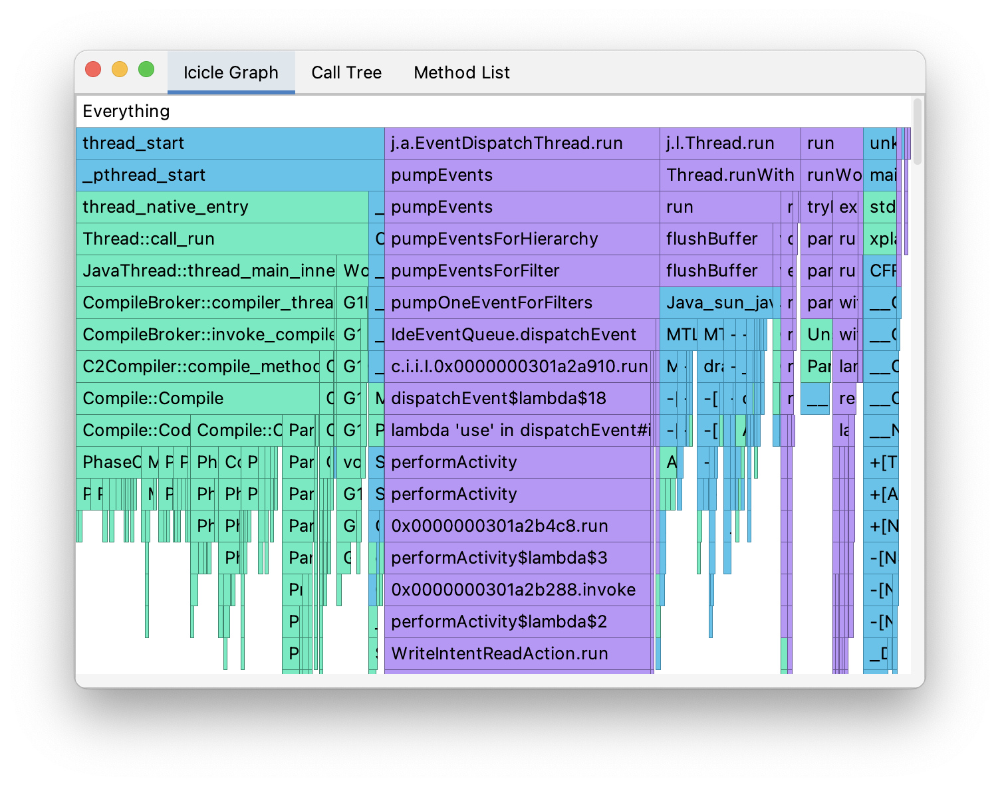

# Deviewer

Deviewer is a project to build UI viewer for various profiled data such as flame graph, flame chars, memory sunburst, etc.

It is planned to support many formats, but the work is in very beginning.



## List of supported files at the moment:

- JFR: Icicle Graph, Call Tree, Method List

## Build and run

To build standalone jar file use follow command:

```shell
gradle shadowJar
```

After this you will find the build file by path [app/build/libs/deviewer-0.0.1-all.jar](app/build/libs/deviewer-0.0.1-all.jar).

To run target file be ensured you have at least Java 17 installed, then call

```shell
java -jar app/build/libs/deviewer-0.0.1-all.jar
```

You also can run the app using next command:

```shell
gradle run
```